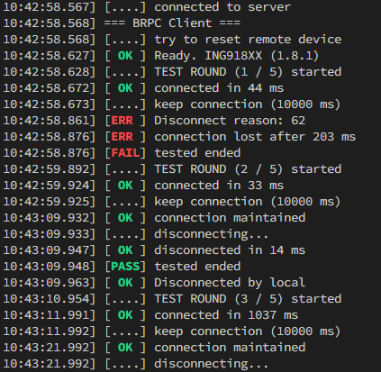

# BLE RPC 客户端

[English](index.md)

这是与 BLE RPC [_服务器_](../../../examples/ble_rpc/doc/index.md) 相对应的 _客户端_.
_客户端_ 程序运行于上位机（通常为 PC），具有以下特点：

* 可以使用绝大部分 BLE API：这个程序看起来就像是运行于 BLE SoC;
* 可以使用上位机操作系统提供的所有 API：这是本地程序。

开发者可以使用这种 _客户端_ 的方式来：

* 开发原型；
* 开展自动化测试；
* ……

本 _客户端_ 已移植到 Window 和 Linux。

_lib_ 文件夹包含客户端的支持库，_app_ 文件夹则包含了几个例子。开发者可以创建自己的客户端应用。

## 配置

### 开发工具

1. Windows

    * 32bit GNU GCC for Windows

        比如从 [这里](https://github.com/skeeto/w64devkit/releases/) 下载基于
        [MinGW-w64](https://www.mingw-w64.org/) 的 **i686** 可执行文件。

    * [GNU Make](https://www.gnu.org/software/make/)

        _make.exe_ 可从 SDK _wizard_ 文件夹里找到。将其加入 PATH 或者复制到 _rpc_client_
        文件夹。

    * [Terminal](https://learn.microsoft.com/en-us/windows/terminal/install)

        这个程序使用了 ANSI 颜色，经典的控制台不支持。

1. Linux

    * 安装 GCC

    * 确保支持 32bit 程序（编译及运行）

        对于 64bit 基于 Debian 的发行版，使用以下命令启用 32bit 程序：

        ```shell
        $ sudo dpkg --add-architecture i386
        $ sudo apt-get update
        $ sudo apt-get install libc6:i386 libncurses5:i386 libstdc++6:i386
        $ sudo apt-get install gcc-multilib
        ```

    * 增大 _mqueue_ 的消息个数

        默认个数 (10) 对本客户端而言太小了。使用以下命令按需增大（或者修改 _init_
        永久性增大）：

        ```shell
        sudo sysctl fs.mqueue.msg_max=100
        ```

1. Windows WSL

    也可使用 WSL2。但是不能使用 WSL1，因为它永远都不会支持 32bit 程序。

进入 _rpc_client_ 目录，运行 `make rebuild app=shell`。如果一切正常，
不论使用哪种操作系统，都会生成 `rpc.exe` 文件。

### 桥接 UART 和 TCP

本 _客户端_ 通过 TCP 套接字连接到 _服务器_。因此，需要创建一个 TCP 服务器等待 _客户端_ 连接，
并在 _客户端_ (TCP) 和 _服务器_ (UART) 之间转发数据。

1. 对于 Linux

使用 [_socat_](http://www.dest-unreach.org/socat/) 桥接 UART 和 TCP。

1. 对于 Windows 和 Linux

使用 [_pyserial_](https://pypi.org/project/pyserial) 提供的示例脚本
[_tcp_serial_redirect.py_](https://github.com/pyserial/pyserial/blob/master/examples/tcp_serial_redirect.py)，
例如使用的串口号为 COM3:

```
python tcp_serial_redirect.py COM3 115200 -P 8888
```

## 测试

这里提供了几个例子。将 _BLE RPC_ 下载到开发板，启动 UART/TCP 桥接程序。
如果这个开发板直接连接到了运行 _客户端_ 的 PC 上，那么运行 `rpc.exe` 时不需要附加参数；
如果开发板、_客户端_ 处于不同的 PC 上，设开发板所在 PC 的 IPv4 地址为 AA:BB:CC:DD，
那么通过命令行 `rpc.exe -addr AA:BB:CC:DD` 运行 `rpc.exe` 。

### _shell_

这个例子通过 BLE 为上位机提供了一个简单的 Shell。编译：

```shell
make rebuild app=shell
```

运行 _rpc.exe_. 然后使用 _ING BLE_ 连接到名为 _Shell_ 的设备。这个设备包含
_INGChips Console_ 服务。输入几个命令，查看结果：


### _conn_test_


这个例子对一个指定的设备 (_Thermometer with FOTA_) 多次进行连接测试，并生成测试报告。编译：

```shell
make rebuild app=conn_test
```

将 _Thermometer with FOTA_ 下载到另一块开发板。运行 _rpc.exe_，观察测试结果：


