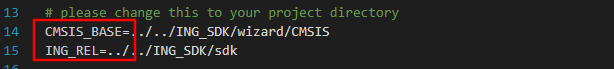
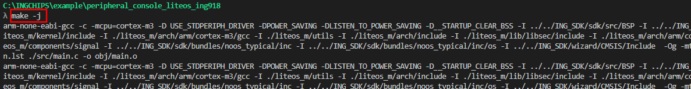
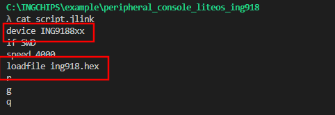
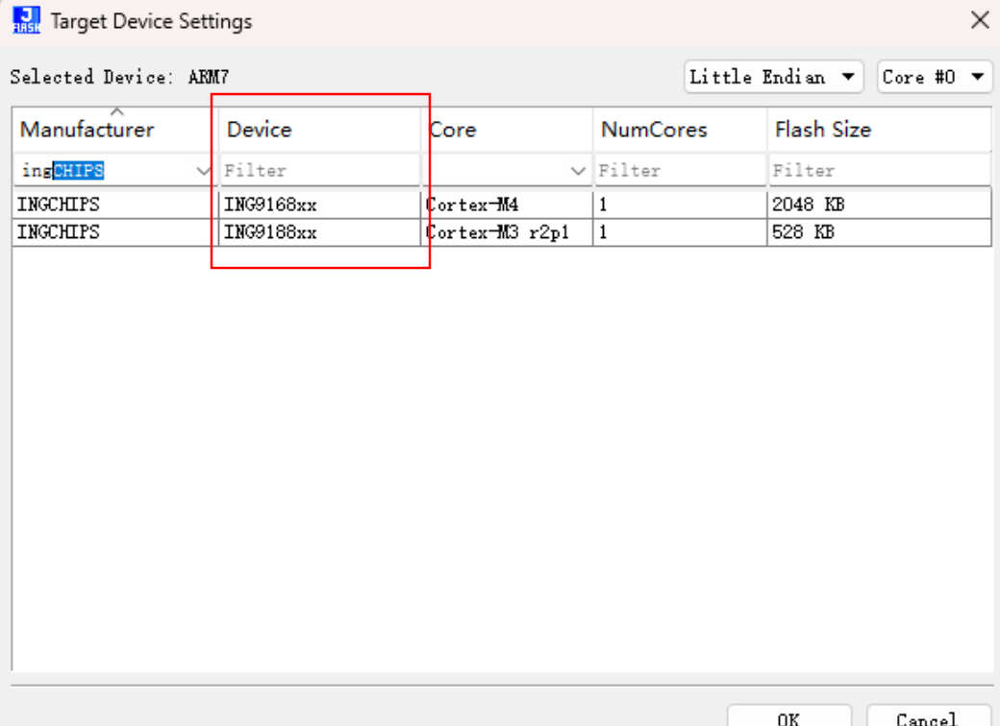
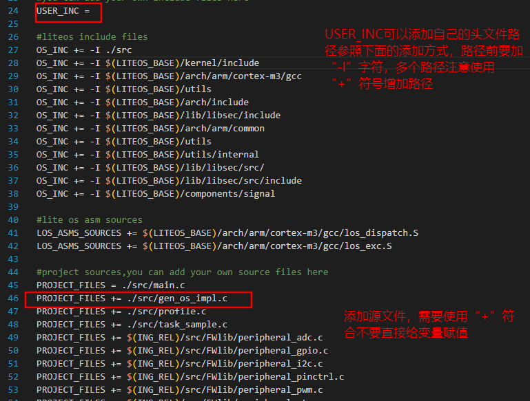
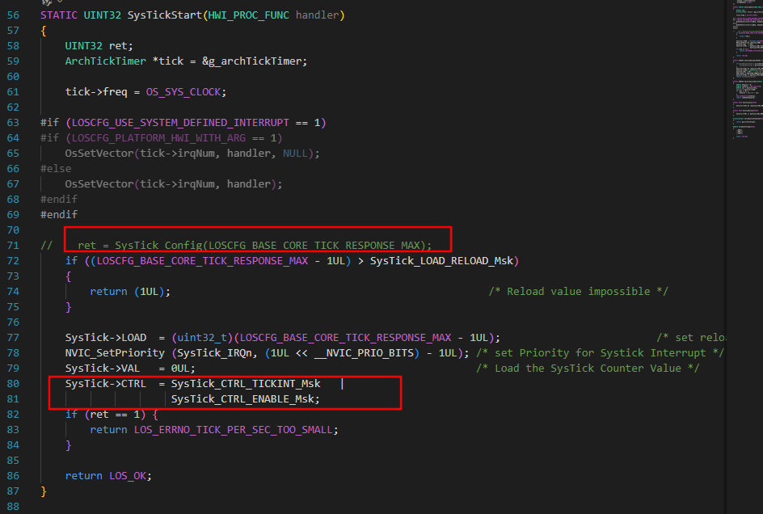
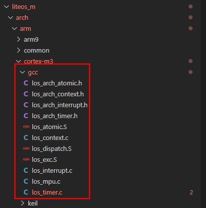

# 使用说明

## 1. 简介

ing918适配鸿蒙liteos-m测试例程。

## 2. 配置

### （1） vscode打开

​	从sdk的example目录中选择一个例程，使用vscode打开文件夹

### （2）sdk配置

​	打开.\Makefile文件，修改 ING_REL=../../ING_SDK/sdk 变量为实际的sdk路径，
    CMSIS_BASE=../../ING_SDK/wizard/CMSIS 变量为CMSIS标准库路径，如下图所示

## 3. 编译

1. 在vs code中打开终端；

2. 使用make命令进行编译，(可以使用make -j指令进行全核多线程编译)如下所示：	

   

4. 编译成功如下：	

  

## 4. 下载

### （1）使用downloader下载协议栈和应用程序

- 打开.\liteos-m\target\ing916_noos_typical\downloader 下的 icsdw916.exe工具。

- 根据实际开发板虚拟串口号，设置downloader工具串口号：

  

- 点击start，然后按下开发板load键（相当于将IO0拉高时，进行硬件reset）进入bootloader，进入下载：

  

### （2）使用自定义命令make download仅更新应用程序（需要预先烧录过platform）：
  使用该命令进行下载时，makefile会调用目录下的script.jlink脚本执行对应命令，如果有更改芯片型号或修改工程名称，需要修改脚本中的对应参数。如图所示：

  >
  

  使用本方法下载程序，需要保证jlink的下载算法包含INGCHIPS的下载算法包（JLink family可以看到ingchips的对应信息）如图所示：

  

  如果没有该算法包，可以参考我们的
  [blog](https://ingchips.github.io/docs/mass_production/swd_burn/)

### （3）其它脚本下载

​	待研究。

## 5. 运行

运行后串口打印如下：

##  6. 如何添加自己的工程文件和include路径
  可以在makefile的PROJECT_FILES变量上增加自己的工程源文件路径（推荐相对路径）参与编译，在USER_INC变量下参照OS_INC的添加方法添加自己的include路径。如图所示：

  

## 7. 如何利用vscode配合gdb进行代码仿真调试
  参考我们的[blog](https://ingchips.github.io/blog/2021-07-29-vscode/)

# 注意事项！！！
 1. 本例程相对于官方的liteos_m内核修改了liteos_m/arch/arm/cortex_m3/gcc/los_timer.c文件用于适配，修改部分如图所示：

  

  官方直接使用了CMSIS标准API对systick时钟进行了初始化，但是我们使用的systick为内部低速时钟源，因此需要将时钟源设置为内部低速时钟源。这里与官方有所区别。

  2.9188芯片使用了CM3内核，在liteos_m中默认只提供了keil版本的启动文件，gcc版本的启动文件为我们基于其示例修改而来，暂时只测试了kernel相关的功能。gcc文件夹内部的内容并非直接来自于官方。对应目录如下：

  
