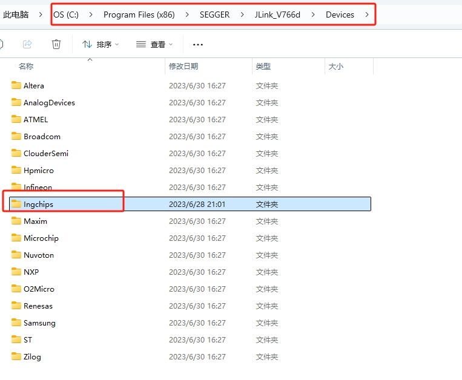

# 使用说明

## 1. 简介

ing916适配鸿蒙liteos-m测试例程。

## 2. 配置

### （1） vscode打开

​	在git主仓库目录用vs code打开文件，假设主目录为：.\liteos-m\

### （2）sdk配置

​	打开.\liteos-m\target\ing916_noos_typical\makefile文件，修改 ING_REL=./sdk 为实际的sdk路径，建议采用相对路径,如下图所示：

## 3. 编译

1. 在vs code中打开终端；

2. 使用cd命令将路径切换到make文件所在目录；

3. 使用make命令进行编译，如下所示：	

   

4. 编译成功如下：	

## 4. 下载

### （1）使用downloader下载协议栈和应用程序

- 打开.\liteos-m\target\ing916_noos_typical\downloader 下的 icsdw916.exe工具。

- 根据实际开发板虚拟串口号，设置downloader工具串口号：

  

- 点击start，然后按下开发板load键（相当于将IO0拉高时，进行硬件reset）进入bootloader，进入下载：

  

### （2）使用自定义命令make download仅更新应用程序（需要预先烧录过platform）：

​	

​	注意jlink驱动segger版本，目前仅验证7.66d版本，需要将\liteos-m\target\ing916_noos_typical\segger_device中的Ingchips文件夹拷贝到segger的devices目录下，如下：

​	有些jlink的segger版本没有devices文件夹，需要研究下如何在gcc下通过jlink下载程序。部分参考资料：

### （3）其它脚本下载

​	待研究。

## 5. 运行

运行后串口打印如下：

