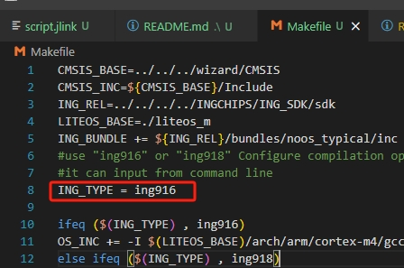

# Peripheral Console (LiteOS)

This example demonstrates how to:

* Integreate NoOS bundle with Huawei LiteOS;
* See also `Peripheral Console`.

# Instructions for use

## 1. Introduction

ing91x is adapted to liteos-m test routine.

## 2. How to change the chip model of a demo.
  Project configuration can be done using the ingwizard tool.
  After modifying the chip model using ingwizard, you need to modify the corresponding chip target in the makefile to enable the corresponding configuration information in the following two ways;
  - Modify the variable `ING_TYPE = ingchips916` directly in the Makefile to change ing916 to `ingchips916` or `ingchips918`.
  
  - When make compiles, it passes in the `ING_TYPE` variable parameter, e.g., `make INGTYPE=ingchips916 -j`, which compiles the code for the 916 chip using the variable parameter ing916.
  
Note: This is EXPERIMENTAL!
