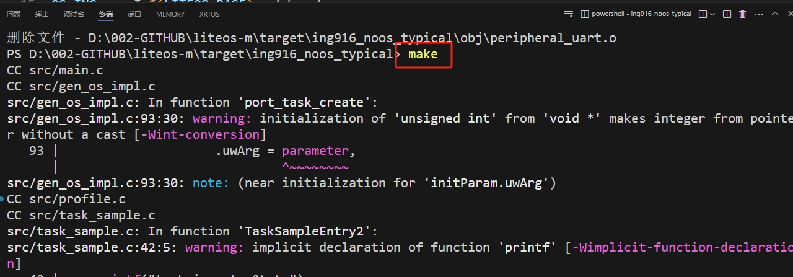
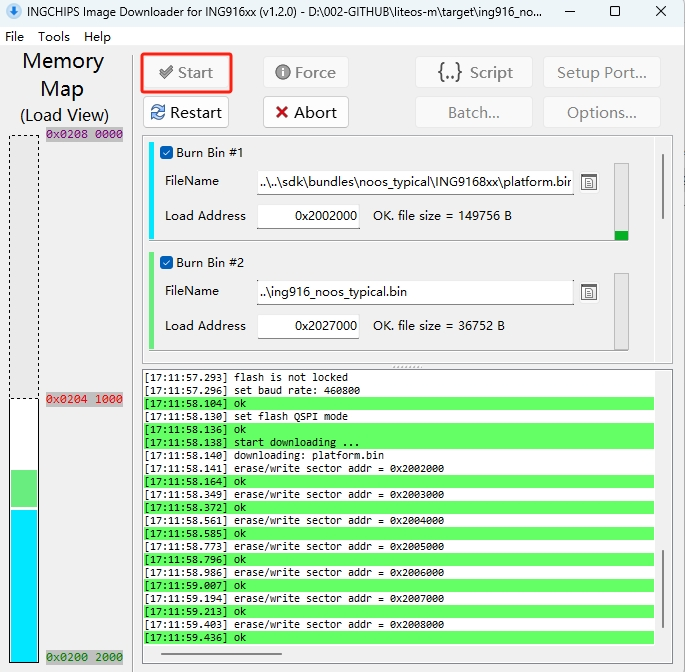
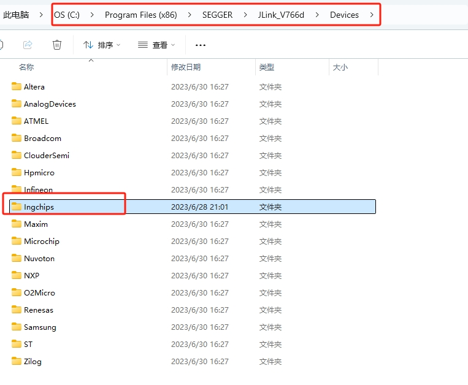
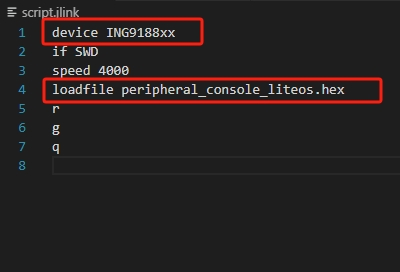
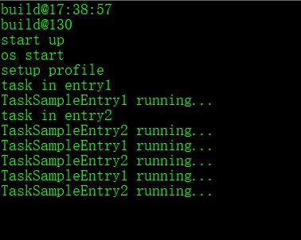
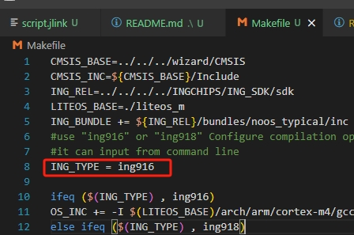

# 使用说明

## 1. 简介

ing916适配鸿蒙liteos-m测试例程。

## 1. 编译

1. 在vs code中打开终端；

2. 使用make命令进行编译，如下所示：	

- 使用 `make release` 命令进行编译：(编译发布版本，不包含调试数据，速度较快无法进行GDB调试)
- 使用 `make debug` 命令进行编译：(编译调试版本，包含调试数据，速度较慢，可以进行GDB调试)
- 使用 `make clean` 命令进行清理：(清理编译文件)
- 使用`-j*`参数可执行多线程编译，如：`make -j8`八个线程编译，数字`8`为线程数量， 使用`make -j`参数全核编译
- *使用`make -j`命令进行编译默认***编译release版本**

   

3. 编译成功如下：	

## 2. 下载

### （1）使用downloader下载协议栈和应用程序

- 打开.\liteos-m\target\ing916_noos_typical\downloader 下的 icsdw916.exe工具。

- 根据实际开发板虚拟串口号，设置downloader工具串口号：

  

- 点击start，然后按下开发板load键（相当于将IO0拉高时，进行硬件reset）进入bootloader，进入下载：

  

### （2）使用自定义命令make download仅更新应用程序（需要预先烧录过platform）：

​	

​	注意jlink驱动segger版本，目前仅验证7.66d版本，需要将\liteos-m\target\ing916_noos_typical\segger_device中的Ingchips文件夹拷贝到segger的devices目录下，如下：

​	有些jlink的segger版本没有devices文件夹，需要研究下如何在gcc下通过jlink下载程序。部分参考资料：

 使用jlink的脚本进行下载注意根据不同的芯片型号进行修改，根据IC型号选择ING9188xx或者ING9168xx
 根据工程名称选择要下载的hex名称如peripheral_console_liteos.hex

 

## 3. 运行

运行后串口打印如下：

## 4. 更改芯片型号进行编译
  可以使用wizard 工具进行工程配置，使用change series选项改变芯片型号。
  - 例： 打开ing wizard，选择demo工程打开右键菜单，选择change series->ING9168XX;
  
  - 修改芯片型号后，"*.ld"链接文件和".makefile"文件会自动修改相关的选项。但是想要正常编译还需要以下操作。
  1. 删除之前编译生成的文件 `make clean`
  2. 修改编译的芯片型号目标有以下两种方式
  - 直接在Makefile中修改变量`ING_TYPE = ing916` 将ing916修改为 `ing916` 或 `ing918`
  
  - 在make进行编译的时候直接传入`ING_TYPE`变量的参数例如 `make INGTYPE=ing916 -j`使用变量参数ing916编译916芯片的代码

## 5. 注意
目前使用的918 芯片内核为coretex-m3官方版本只提供了keil版本的的.S启动代码，目前gcc版本代码由我们自行修改。