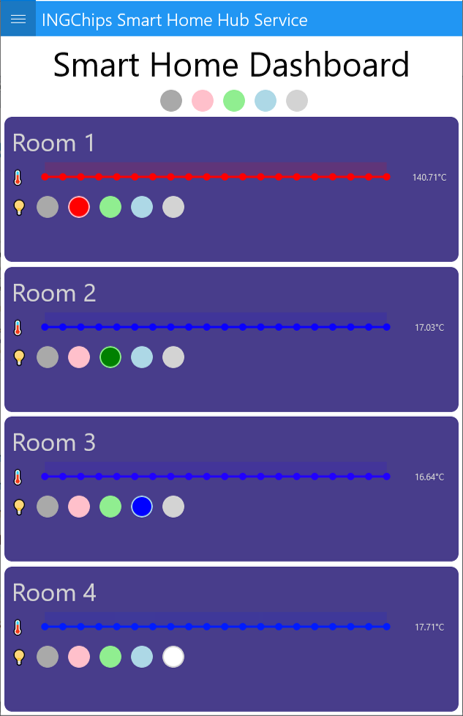

# Smart Home Hub

This example is developed using [Nim](https://nim-lang.org) programming language.
It demonstrates how to:

* Use Nim together with C:
    * Compile time evaluation;
    * Functional programming;
* Design an BLE hub (BLE gateway) supporting lights and thermometers;
* Use central role to:
    * Scan & connect to peripheral devices;
    * Discovery SIG and user defined services & characteristics;
    * Get notification when characteristics value updated;
* Indicate values;
* Use multiple central & multiple periphral roles simultaneously.

## Build

| :exclamation: This demo only support ING918xx.    |
|-----------------------------------------          |

To build this project, both Gnu Arm Toolchain & 32-bit Nim are needed.

Set `NIM_PATH` to the path containing `nim` executable, and `make`. Tested with Nim 1.6.10, 2.0.0 and 2.0.2.

## Test

To test this project, another _room_ project is needed.

### The _room_ Project

Develop a peripheral project which contains the SIG [Health Thermometer service](../../../examples/thermo_ota/doc/index.md) and/or
[INGChips LED service](../../../examples/peripheral_led/doc/index.md).

Download the project to 1~4 Dev-Boards using addresses in [`slaveAddreses`](../src/profile.nim).

### Test

Download this project to another Dev-Board, and connect to it using _ING BLE_. After all peripherals
are connected, read temperature values and control the LED light in each room.

## Design Details

Modules in [`nimmodules`](../nimmodules/) are converted from C headers by [`c2nim`](https://github.com/nim-lang/c2nim).