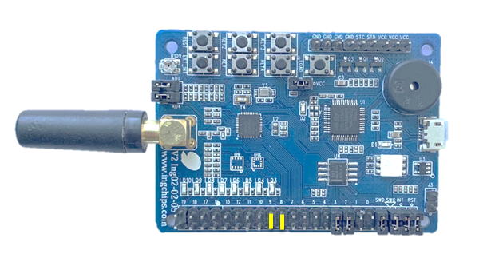

# Anti-Lost

This pair of examples, _Anti-Lost (Central)_, and _Anti-Lost (Peripheral)_ use BLE scannable advertising
and active scan to demonstrate an anti-lost system:

* _Central_ adds _Peripheral_'s address into its accept list
* _Peripheral_ adds _Central_'s address into its accept list
* _Peripheral_ sends scannable (scannable and connectable if legacy adv is used) advertising
* _Central_ actively scans for _Peripheral_'s advertising

_Peripheral_ creates a lost timer called `timer`, which expires after 10 seconds. When `timer` expires,
in `vTimerCallback`, a PWM (for example, 500Hz and 50% on duty) signal is generated to drive the buzzer.
Each time _Peripheral_ receives a scan request, an `HCI_SUBEVENT_LE_SCAN_REQUEST_RECEIVED` event is emitted.
In the handler of this event, `timer` is reset, and an LED is blinked.

_Central_ also creates a lost timer called `timer`, which expires after 10 seconds. When `timer` expires,
as in _Peripheral_, a PWM (for example, 500Hz and 50% on duty) signal is generated to drive the buzzer.
Each time _Central_ receives a scan response, an `HCI_SUBEVENT_LE_EXTENDED_ADVERTISING_REPORT` event is emitted,
of which `HCI_EXT_ADV_PROP_SCAN_RSP` is set in `evt_type`. In the handler of this event, `timer` is reset,
and an LED is blinked.

## Hardware Setup

### ING918XX Dev-Board

Connect these two jumpers (Yellow line), where GPIO8 is connected to the on-board buzzer and
GPIO9 is connected to LED4:

