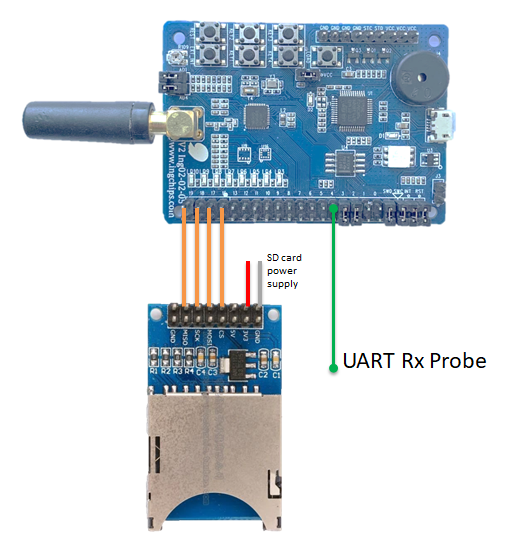

# 数据记录器 (Data Logger)

[English](index.md)

本应用受 [OpenLog](https://github.com/sparkfun/OpenLog) 启发而开发。它可以读取配置，把从串口或者 BLE
采集到的数据保存到 SD/TF 卡。

配置文件为卡里的 **CONFIG.TXT**。如果该文件不存在，应用启动时会自动创建并将各配置项的默认值写入。
这个文件的每一行都是一个项-值对：`key=value`。

文件 I/O 借助 [FatFs](http://elm-chan.org/fsw/ff/00index_e.html) 实现。SD 卡必须格式化为 FAT 或者 exFAT。
日志文件名为 **XXXXX.TXT**，其中 `XXXXX` 为序号，每次新建日志文件时会增加。

## 硬件搭建

PIN 默认设置见 [profile.c](../src/profile.h)。要运行这个应用，需要准备 1 个 SPI 接口的 SD/TF 模块，1 张
SD 或者 TF 卡，1 个 3.3v 电源。

当使用 ING918xx 开发板时，默认的硬件搭建方式如图所示：



## 配置

|项                 | 说明                          | 允许值                        |
---                 | ---                           | ---                           |
|mode               | 工作模式（数据源）            | ble \| uart                   |
|use_timestamp      | 日志中是否添加时间戳          | 0 \| 1                        |
|uart_baud          | UART 波特率                   | 整数    (115200, 9600, etc)   |
|uart_parity        | UART 校验                     | none \| odd \| even           |
|uart_stop_bits     | UART 停止位                   | 1 \| 2                        |
|uart_data_bits     | UART 数据位                   | 5 \| 6 \| 7 \| 8              |
|uart_data_fmt      | UART 数据记录格式             | raw \| str                    |
|ble_data_fmt       | BLE 数据记录格式              | raw \| hex                    |
|ble_phy            | BLE PHY                       | coded \| 1M \| 2M             |
|ble_addr_type      | BLE 设备地址类型              | public \| random              |
|ble_addr           | BLE 设备地址                  | 16 字节. 任意值.              |
|ble_service_uuid   | BLE 服务 UUID                 | 16 字节. 任意值.              |
|ble_char_uuid      | BLE 特征 UUID                 | 16 字节. 任意值.              |

说明：

* 对于 UART 模式，时间戳设置仅在 `uart_data_fmt` 为 `str` 才有效。

对于 BLE 模式，还有一些针对 BLE 连接的配置项：

|项                  | 说明                           |
---                  | ---                            |
| scan_int           | 扫描间隔                       |
| scan_win           | 扫描窗口                       |
| interval_min       | 最小连接间隔                   |
| interval_max       | 最大连接间隔                   |
| latency            | 从设备延迟                     |
| supervision_timeout| 超时时间                       |
| min_ce_len         | 连接事件最小长度               |
| max_ce_len         | 连接事件最大长度               |

## 测试

插入一张空白卡，下载应用，检查 UART 的 `printf` 打印，判断文件系统是否成功挂载。将卡转移到读卡器，检查
**CONFIG.TXT** 文件是否创建。如果一切正常，数据记录器就准备好了。

### 记录串口数据

另外准备一块开发板 (Board-B)，使用向导 (Wizard) 创建一个新应用，使其不断向串口输出字符串。比如：

```c
uint32_t setup_profile(void *data, void *user_data)
{
   int i = 0;
   for (;;)
   {
      printf("message #%d\n", i++);
      vTaskDelay(100);
   }
}
```

确认 **CONFIG.TXT** 里的相关配置如下所示：

```
mode=uart
use_timestamp=1
uart_baud=115200
uart_parity=none
uart_stop_bits=1
uart_data_bits=8
uart_data_fmt=str
```

将 **UART Rx Probe** 连接到 Board-B 的串口输出脚 (Tx)，给两个开发板上电。等待一段时间（1 分钟或更长），
将卡转移到读卡器，检查是否生成了一个新的 **XXXXX.TXT** 文件，里面包含 Board-B 打印出的字符串：

```
[00:00:05.936,004]message #406
[00:00:06.137,664]message #407
[00:00:06.239,135]message #408
```

### 记录温度数据

另外准备一块开发板 (Board-B)，下载 `Thermometer with FOTA` 示例。

如下所示，修改 **CONFIG.TXT** 里的相关配置：

```
mode=ble
use_timestamp=1
ble_data_fmt=hex
ble_phy=2M
ble_addr_type=random
ble_addr=CDA32811893e
ble_service_uuid=00001809-0000-1000-8000-00805F9B34FB
ble_char_uuid=00002A1C-0000-1000-8000-00805F9B34FB
```

给两个开发板上电。等待一段时间（1 分钟或更长），将卡转移到读卡器，检查是否生成了一个新的 **XXXXX.TXT** 文件，
里面以十六进制表格形式记录了 Board-B 上报的每个温度数据：

```
[00:00:02.470,153]
 0  1  2  3  4  5  6  7  8  9 10 11 12 13 14 15
===============================================
00 D1 09 00 FE                                   | .....
```