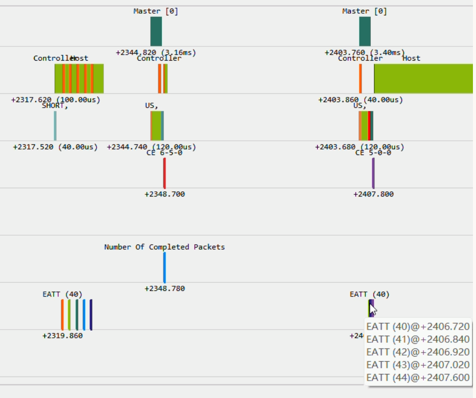

# Enhanced ATT (EATT)

## Overview

This example demonstrates how to use EATT (Enhanced Attribute Protocol) to perform GATT operations over multiple ATT bearers,

## Key Features

- GATT Client Operations over EATT
- Service and characteristic discovery
- Characteristic read

## Test

1. Build and flash the example firmware onto two development boards. One board acts as the Master (defining `APP_ROLE=0`), and the other acts as the Slave (defining `APP_ROLE=1`).
1. After booting, the Slave starts advertising.
1. Once the connection is established, the devices complete pairing and bonding, and EATT (Enhanced ATT) channels are successfully created.
1. Master performs GATT service and characteristic discovery.
1. Master sets up a timer
1. When the timer times out, Master reads value from multiple characteristics value simultaneously.

From Tracer, we can see that all 5 ATT read requests can be sent out within a single connection event, and all 5 responses
can be received in the next connection event:

