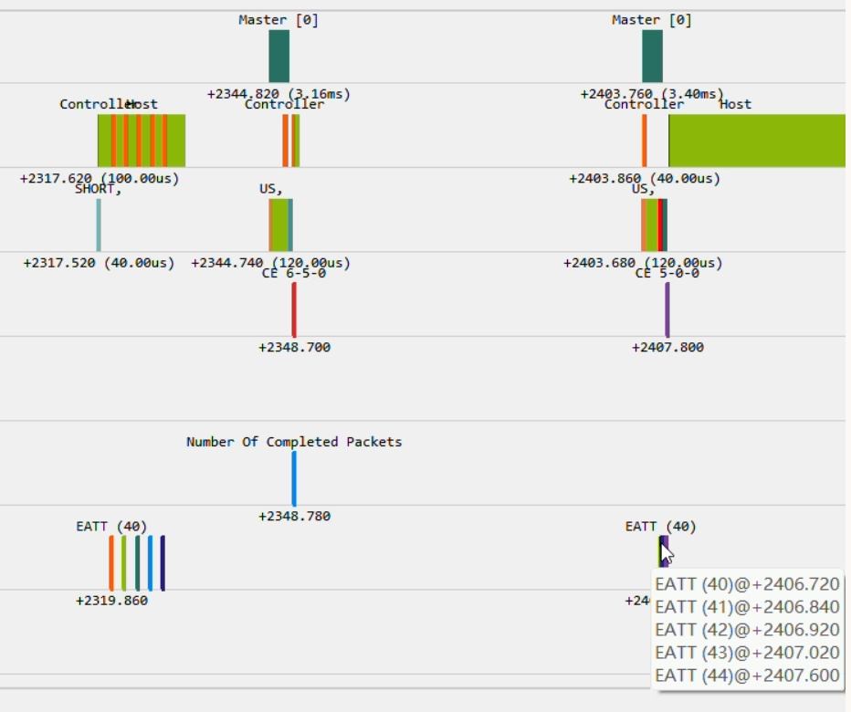

# EATT Example

## Overview

This example demonstrates the full BLE Enhanced ATT (EATT) flow, focusing on concurrent data transfer over multiple bearers. The example contains two sides.

1. Slave side.
2. Master side.

After the devices connect and complete pairing, the Master discovers and negotiates EATT capability, creates multiple EATT bearers, and then automatically triggers concurrent GATT read/write operations. The Slave side automatically triggers concurrent notify/indicate operations.

## Behavior From Code

### 1. Role and Connection Flow

1. Role is selected by compile-time macro APP_ROLE (default: Master).
2. Slave starts connectable advertising at startup.
3. Master automatically initiates connection at startup.
4. Pairing is requested after link establishment (Just Works).

### 2. EATT Capability Negotiation

After pairing is complete, the Master performs the following steps.

1. Discover all services and characteristics.
2. Read Server Supported Features (UUID 0x2B3A).
3. Write Client Supported Features (UUID 0x2B29).
4. Call gatt_client_le_enhanced_connect to create NUM_EATT_BEARERS (5) bearers.

### 3. Concurrent Traffic Tests

Tests are timer-driven and run automatically.
Master sequence.
1. Concurrent read on 5 custom characteristics.
2. Concurrent write (with response).
3. Concurrent write without response.

Slave sequence.
1. Concurrent notify on 5 custom characteristics.
2. Concurrent indicate on 5 custom characteristics.

## GATT Structure

The Slave dynamically builds an ATT database containing the following items.

1. GAP Service (device name: EATT).
2. GATT Service.
3. Client Supported Features (0x2B29).
4. Server Supported Features (0x2B3A).
5. Custom Service 0xFF00.
6. Five custom characteristics: 0xFF01 to 0xFF05.

Each custom characteristic supports Read, Write, and Write Without Response, and is used to verify concurrent behavior.

## How to Run

### 1. Prepare Two Development Boards

1. Flash Slave firmware to one board.
2. Flash Master firmware to the other board.

Note: APP_ROLE defaults to CONST_MASTER. For Slave firmware, set APP_ROLE to CONST_SLAVE (via project macro or source configuration).

### 2. Expected Runtime Behavior

1. Slave log shows advertising started.
2. Master initiates connection automatically; log shows connection complete.
3. Pairing succeeds and log shows SM: PAIRED.
4. Master log shows EATT client connected.
5. Periodic logs show concurrent read/write or notify/indicate operations.

### 3. Key Log Keywords

1. role: Master / role: Slave.
2. connection complete.
3. SM: PAIRED.
4. EATT Supported.
5. EATT client connected.
6. start read / start write.
7. notify char / indicate char.

## GATT Read Over EATT Bearers

The figure below captures a typical multi-handle read phase after EATT negotiation succeeds and multiple EATT bearers are created.

## Notes

1. If the peer does not support EATT, multiple bearers are not created and concurrency is limited.
2. After disconnection, Master resets and restarts the flow; Slave resumes advertising.
