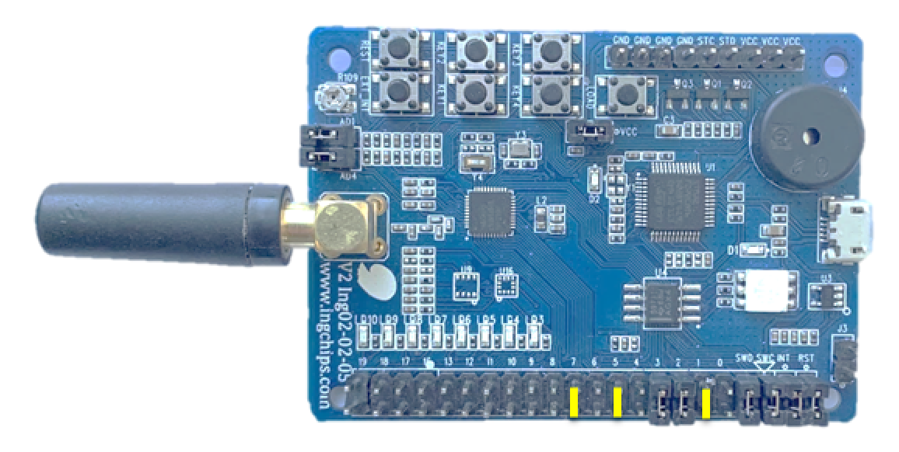

# HID Keyboard

This example implements an HID keyboard with passkey paring.

## Hardware Setup

On ING918xx Dev-Board, Key 1/2/3 are used to input 1/2/3.

</img>

## Test

Take this example as a normal Bluetooth keyboard and add it to the system. This example has been tested
on below systems:

* RedMi Note5 (MIUI 11.0.2)
* iPhone XR (iOS 14.5)
* Thinkbook 13s (Win10 Home 20H2, Win11 Home).

When pairing, use a terminal emulator or other serial tools to send the passkey since there are only
three keys on board.

## Terminal Input

Besides pressing on-board keys to input "1/2/3", it also possible to use a terminal emulator
(such as PuTTY) to connect to the default UART, type some printable ASCII characters into the terminal
tool, and these characters will be sent to host system to which this BLE keyboard is attached.

Tip: Do **NOT** run the terminal emulator on the same system to which this BLE keyboard is attached.

## Design Details

Changes of keyboard status are printed to UART (`set_led_state`).

Up to `INPUT_REPORT_KEYS_MAX` keys are supported in a single report, which is configurable.

Paring data is stored into Flash with the help of `kv_storage` module.