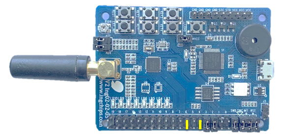
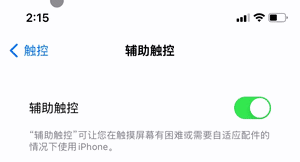

# HID Mouse

This example implements an HID mouse with Just Works paring.

## Hardware Setup

On ING918xx Dev-Board, connect jumpers for GPIO 4 (Key 4) & 6 (LED 3):

On ING916xx Dev-Board, connect jumpers for GPIO 9 (Key 4) & 6 (LED 3):

</img>

## Test

Keep Key 4 pressed for several seconds then release, LED 3 will start flashing. Now take this
example as a normal Bluetooth mouse and add it to the system. This example has been tested on below
systems:

* RedMi Note5 (MIUI 11.0.2)
* iPhone XR (iOS 14.5)

    Note: If their is no pointer on the screen, turn on AssistiveTouch.

* Thinkbook 13s (Win10 Home 20H2, Win11 Home).

After the mouse is added, the pointer will start to move in a cycle. Size of the cycle depends on
the resolution of the hardware and the underlying operating system.

When you test HID mouse on ING916xx Dev-Board, it demonstrates how to control the device it connected 
page-up and page-down. For this effect bases on QDEC peripheral, please input two signals phase_a and phase_b.
Like you can find a real mouse with a mouse wheel.

More information please reference 916xx Developer's Handbook, QDEC section.

## Design Details

This example uses resolvable address, and device's identity address is protected from unintentional
access.

Mouse movement is simulated by sending predefined $(d x, d y)$ pairs (see `delta_xy`) periodically.

Paring data is stored into Flash with the help of `kv_storage` module.