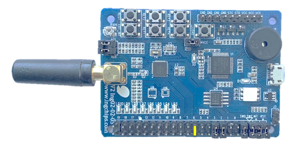

# I/O Over BLE

This pair of examples (_Central_ and _Peripheral_) create a opaque channel over BLE between two
devices identified by `pair_config`.

Following types of I/O are defined:

1. `IO_TYPE_UART_STR`

    Strings send to device A's UART will be transfer to device B, and output from its UART, and vice versa.

1. `IO_TYPE_UART_BIN`

    Data send to device A's UART will be transfer to device B, and output from its UART, and vice versa.

    Data input from UART are treated as raw bytes and transferred to peer device untouched, while
    in `IO_TYPE_UART_STR`, data are firstly split into strings then transferred.

1. `IO_TYPE_LOOPBACK`

    Data received from BLE are automatically bounced back. Obviously that, only one device (_Central_
    or _Peripheral_) is allowed to use this type of I/O.

1. `IO_TYPE_USB_BIN`

    Valid only for 916 series. Receive data from USB of device A( _Central_ or _Peripheral_), transfer the data through
    wireless ble to device B( _Central_ or _Peripheral_), and then send the data to USB of device B.

## Hardware Setup

Jumpers of both _Central_ and _Peripheral_ marked as yellow should be connected:

## Design Details

_Central_ and _Peripheral_ share some source codes.

A ring buffer (`ring_buf` module) is used to cache UART data. High water mark event is used to trigger BLE
transmission.

### IO_TYPE_USB_BIN type

-   Change IO_TYPE to IO_TYPE_USB_BIN in macro definition in both _Central_ and _Peripheral_.
-   USB driver is initialized at `io_interf_init()`, after initialization, usb device should be identified by host(or PC), default usb class in `usb_driver.c` is WINUSB.
Refer to chapter `USB -> example 0: WINUSB` in _Programmer's Guide - ING916xx Peripherals_ for more information.
-   `io_interf_push_data()` is called in `usb_driver.c` whenever there is data received on USB OUT endpoint.
-   Similarly, `HANDLE_FUNC()` will send any data received by wireless ble to USB IN endpoint.
-   Test this app via write and read command with `ing_usb.exe`. Refer to chapter `USB -> example 0: WINUSB` in _Programmer's Guide - ING916xx Peripherals_ for more information.

