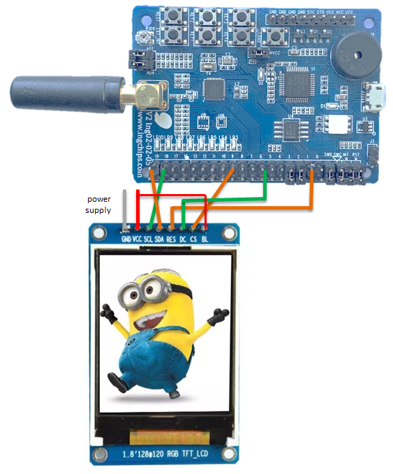

# LittlevGL (LVGL)

This example is a port of [LVGL](https://lvgl.io) on ING918xx/ING9186xx chip families.

## Hardware Setup

To test this example, an LCD module driven by ST7735S (128\*160) or ST7789 (240\*320) is
needed (see [`lcd_drv.c`](../src/lcd/lcd_drv.c)).
Take ING918xx Dev-Board as an example, the LCD module is connected like this:

