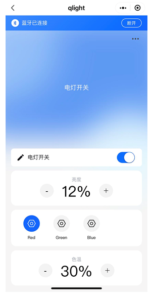

# LLSync Light

This example creates a RGB LED light with [LLSync](https://github.com/TencentCloud/tencentcloud-iot-explorer-ble-sdk-embedded).

## Hardware Setup

* ING918XX Dev-Board

Jumpers marked in below figure should be connected:

## Test

In WeChat, search and launch _Tencent LianLian_ mini program. Add this device, then the light can be
controlled in the mini program:

