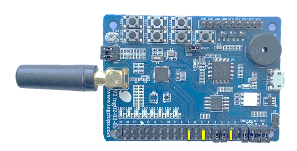

# Peripheral ANCS

This example implements the Apple Notification Client Serivce. After paired with an iPhone, this example
can display various notifications generated by the phone, including:

* Accept/reject incoming calls
* Show messages

## Hardware Setup

Three keys are used in this example, the marked jumpers should be connected:

Functions of keys:

* Key 1: Accept
* Key 2: Reject
* Key 3: Erase bonding information and restart

## Test

Use an iPhone to connect and pair with this example, then do the following tests:

* Call the phone and try use key 1 & 2 to accept or reject the incoming call;
* Send a message to the phone, and a portion of the message will be printed to UART.

Note: The message is encoded in UTF-8.
