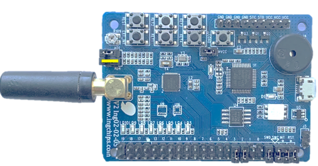

# Peripheral Battery

This example demonstrate the _Battery Service_ and usage of ADC.

## Hardware Setup

To test this example on ING918xx Dev-Board, jumper of ADC 4 should be connected:

## Test

Download this example to a Dev-Board, use _ING BLE_ to connect to it, turn the on board variable
resistor slowly and check if the reported battery level changed accordingly. Also check the UART
output.

## Design Details

* This example shows how to do ADC self calibration:

    1. Call `adc_prepare_calibration()` in `app_main()`
    1. Call `adc_calibrate` to post-process the raw ADC value.

* `read_adc()` should be used as a reference to read ADC value although it looks like weird.