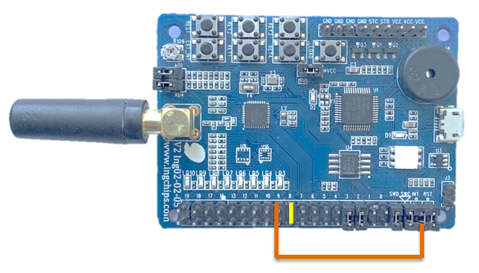

# Peripheral Console

This example provides a simple console over BLE, after connected with _ING BLE_, commands can be
issued, and response are displayed.

This example also demonstrate the use of power saving, which can be turned on and off on-the-fly
through a command.

## Hardware Setup

To test this example on ING918xx Dev-Board, the marked jumpers should be connected:

Note that the `EXT_INT` key also connected GPIO 9.

## Test

Download this example to Dev-Board, the buzzing indicates that the SoC has entered deep sleep and waken
up again, busy with advertising. Connect it with _ING BLE_, the buzzing will become faster indicating
that the SoC is now busy with connection activities which is more frequent than advertising.

* Type `ps 0` command to the console, then power saving is disabled and the buzzing stops. Type `ps 1`
to re-enable it;

* Type `ver` to check the version number of platform;

* Type `f` to check the frequency of the 32k clock;

* Check out [`service_console.c`](../src/service_console.c) for more commands.

Hold the `EXT_INT` key down will prevent the SoC from entering deep sleep mode, and the buzzing will
stop, too. Release the key, the buzzing resumes. If connected with _ING BLE_, a key event is also
reported when `EXT_INT` is clicked, clicked for multiple times, or keep pressed for a period of time.