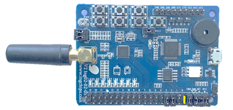

# Peripheral LED & CTE

This example is threefold:

* a RGB LED that can be controlled by _ING BLE_
* a CTE responder in connection mode
* Proprietary connection-less AoA

## Hardware Setup

* ING918xx Dev-Board: Marked jumpers should be connected:

    

## Test

Download the this example. Then test each function:

* RGB LED: The on-board LED goes between dim and bright when unconnected.

    Connect with _ING BLE_ to the device, and modify its RGB components.

* CTE responder in connection mode: Ref to [_Central CTE_](../../central_cte/doc/index.md)
    without `PRO_MODE`.

* Proprietary connection-less AoA: Ref to [_Central CTE_](../../central_cte/doc/index.md) with `PRO_MODE`.