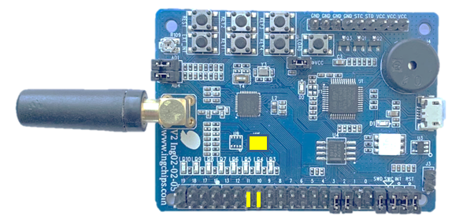

# Peripheral Pedometer

This example creates a pedometer using the on-board acceleration sensor. Relevant data is reported
through _Running Speed and Candence Service_.

## Hardware Setup

* ING918xx Dev-Board: Marked jumpers should be connected, and make sure the sensor in the yellow rectangle is not missing:

    

Note: If the sensor is missing, compiling option `SIMULATION` can be used to generate fake data.

## Test

Download this example to a Dev-Board, and connect it with _ING BLE_. Walk around for several seconds
and check if number of steps is reported.

## Design Details

* Step estimation is implemented in [`step_calc.c`](../src/step_calc.c)