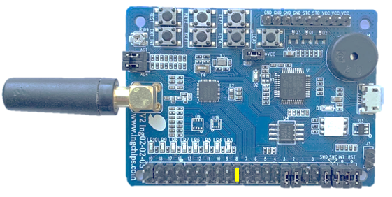
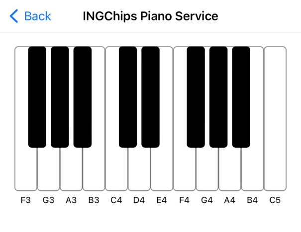

# Peripheral Piano

This example enables _ING BLE_ to control the frequency of the buzzer hopefully. The buzzer is driven
by PWM output.

## Hardware Setup

* ING918xx Dev-Board: Marked jumpers should be connected,

    

# Test

Download this example to a Dev-Board, connect it with _ING BLE_ and play your favorite songs:

