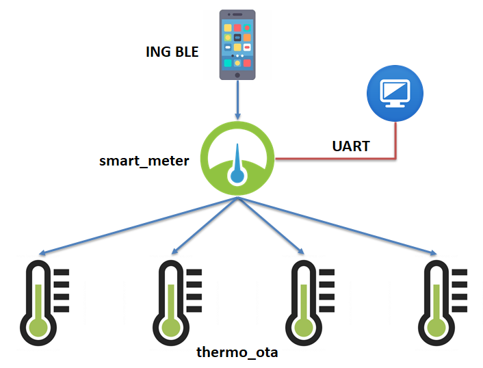
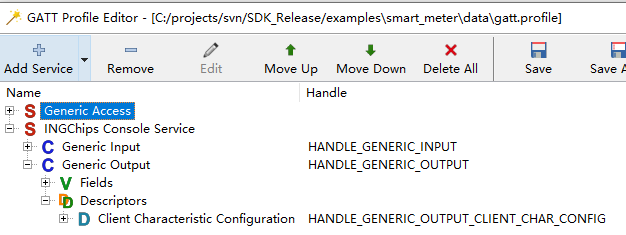

# Smart Meter

[中文版](index_cn.md)


_Smart Meter_ as a _Central_ device, can connect to up to 4 peripheral devices (4 _Thermometer with FOTA_);
as a _Peripheral_ device, it can be connected by a smart phone and reports temperature measurements
collected from 4 thermometers to the smart phone. Also, _Smart Meter_ can be controlled by host machine
through UART, setting addresses of thermometers, starting/stopping the program, etc.



_Smart Meter_ defines a customized GATT service, with which a character based communication channel is
created between the smart phone and the device. _Smart Meter_ uses this channel to report temperature measurements.
[_Peripheral Console_](../../peripheral_console/doc/index.md) also uses this service.

## Development Details

### 1. Use Wizard to Create a Peripheral App

Use _Wizard_ to setup advertising data and GATT Profile. Add the customized GATT service into the
profile.



### 2. Define the Peripheral (i.e. Thermometer)

A thermometer is identified by its address and `id`. Each device uses a dedicated connection (`conn_handle).

```C
typedef struct slave_info
{
    uint8_t     id;
    bd_addr_t   addr;
    uint16_t    conn_handle;
    gatt_client_service_t                   service_thermo;
    gatt_client_characteristic_t            temp_char;
    gatt_client_characteristic_descriptor_t temp_desc;
    gatt_client_notification_t              temp_notify;
} slave_info_t;
```

### 3. Scan & Connect to Thermometers

Call two GAP functions to start scanning, once a thermometer waiting for connection is found, stop
scanning and call `gap_ext_create_connection` to create a connection. After a connection is established,
check if there are remaining once: if so, start scanning again.

### 4. Discover Services

This part uses a series of `gatt_client` API. These API share the similar logic as those of Android and iOS.

### 5. Data Transmission

Subscribe to temperature value, convert the value to strings, then sent them to the host through UART.
If a _Central_ device (_ING BLE_) has connected, data are also transferred to it through GATT service.

### 6. Robustness

* If a connection with a thermometer is lost, start scanning

* If the connection with _Central_ is lost, start advertising and wait for connection

## Test

### 1. Prepare Thermometers

Downloader has a built-in Pasal engine, when a .bin file start downloading, a user proviced function
is called where the data can be modified on the fly. Addresses of each thermometer is stored in a bin
file, add the file to the Downloader (assume it is the 6th file), the script below will modify the first
byte of the address according to the downloading counter:

```pascal
procedure OnStartBin(const BatchCounter, BinIndex: Integer;
                     var Data: TBytes; var Abort: Boolean);
begin
  if BinIndex <> 6 then Exit;
  Data[0] := BatchCounter;
end;
```

It is also possible to use the Python Downloader, and in this case [Python script](https://ingchips.github.io/user_guide_cn/core-tools.html#python-%E7%89%88%E6%9C%AC) can be used to do the job.

Suppose the download address of the bin is `X`, modify _Thermometer with FOTA_ to get address from this
location like this:


```c
gap_set_adv_set_random_addr(0, (uint8_t *)X);
```

Download the modified _Thermometer with FOTA_ to four Dev-Boards.

### 2. Test

Download _Smart Meter_ to another Dev-Board, input `start` from host to start _Start Meter_.
Use _ING BLE_ to connect to the device named _ING Smart Meter_, and check the temperature reports.
Randomly reset one or more thermometers, and check that _Smart Meter_ can automatically re-establish
the connections.