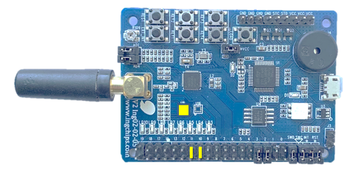

# Thermometer with FOTA

This example collects temperature data using the on board sensor, and report it using _Health Thermometer_
service.

This example supports two type of FOTA using _INGCHIPS FOTA Serivce_, secure and unsecure, which is
configurable by defining `SECURE_FOTA`.

## Hardware Setup

* ING918xx Dev-Board: Marked jumpers should be connected, and make sure the sensor in the yellow rectangle is not missing:

    

Note: If the sensor is missing, compiling option `SIMULATION` can be used to generate fake data.

## Test

Download this example to a Dev-Board. Use _ING BLE_ to connect to it, and check the temperature reports.

Rebuild this example by defined `V2`, than create FOTA package
and test FOTA with FOTA tools, such as _ING BLE_, _Central FOTA_, or _FOTA Web Tool_.

[_Secondary FOTA_](../../secondary_fota/doc/index.md) can also be activated through the FOTA service.

## Other Resources

* [A Quick Demo of FOTA](https://ingchips.github.io/blog/fota_demo_zh/)
* [Secure Update Over the Air](https://ingchips.github.io/blog/2021-04-20-secure-fota/)