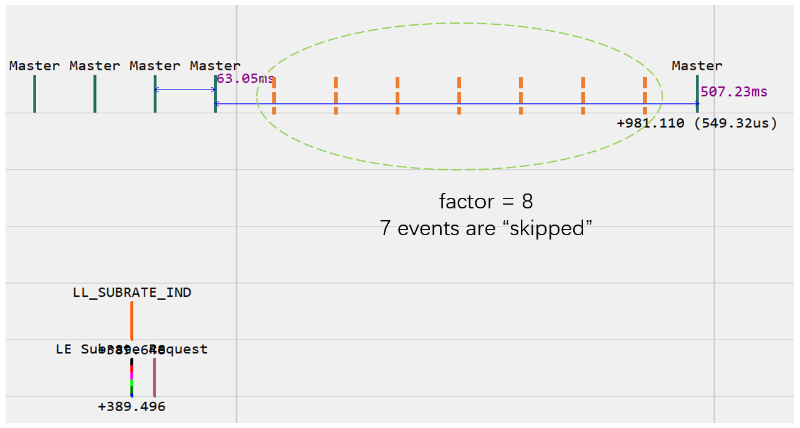
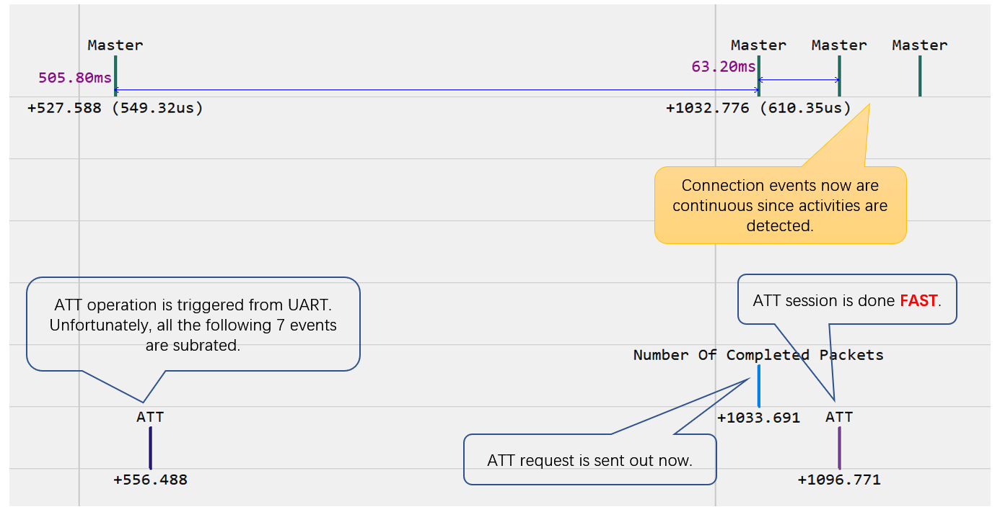

# UART GATT Console

This example demonstrates lots of BLE functionalities controlled through UART:

* Advertising data modification
* Scanning (passive and active)
* Connect to a device
* Service discovery
* Read/write/subscribe to a characteristic
* Different trace sink driver
* Power Control
* Subrating
* Dump through UART

## Commands

This example exposes a command line interface through UART. Some notable commands are listed below.

:exclamation:**IMPORTANT:** This example's purpose is to demonstrate functionalities and usage of APIs. Some of the
commands may not work if another specific command is sent, such as `ascan` after `scan`, `conn AAA`
after `conn BBB`. Just reset before sending these commands.

### Advertising

* `name new_name`

    Change advertising name to `new_name`.

* `addr new_address`

    Change the random address to `new_address`, such as `01:02:03:04:05:06`.

* `start`/`stop`

    Start/Stop advertising using the settings given above.

### Scanning

* `scan`

    Start passive scanning, not using acceptance list.

* `scan address`

    Start passive scanning, only receiving data from `address` (such as `01:02:03:04:05:06`).

* `ascan`

    Start active scanning, not using acceptance list.

* `ascan address`

    Start active scanning, only receiving data from `address` (such as `01:02:03:04:05:06`).

When scanning is started, advertising data and other information are printed to UART.

### Connection

* `conn address`

    Try to connect to device with `address` (such as `01:02:03:04:05:06`).

* `cancel`

    Cancel (Abort) the attempt to connect to the device specified in above `conn` command.

After the connection is established, the whole GATT profile is discovered and printed. GATT client
& connection control commands can be sent.

### GATT Client

* `read value_handle`

    Read the value of the characteristic with `value_handle`. The value is printed in hex format.

* `write value_handle XX XX ...`

    Write value to the characteristic with `value_handle`. The value `XX XX ...` is input in hex
    format (such as `01 02 0A ...`).

* `w/or value_handle XX XX ...`

    Write value (use the Write Without Response procedure) to the characteristic with `value_handle`.
    The value `XX XX ...` is input in hex format (such as `01 02 0A ...`).

* `sub value_handle`

    Subscribe to the characteristic with `value_handle`. Once a notification is received, the value
    is printed in hex format.

* `unsub value_handle`

    Unsubscribe to the characteristic with `value_handle`.

### Connection Control

* `phy new_phy`

    Change PHY to `new_phy`, where `new_phy` is `1m`, `2m`, `s2`, or `s8`.
    When `s2` or `s8` is used, this example's Tx PHY is changed to `s2` or `s8` respectively;
    the peer's PHY is changed to Coded, whether it is `s2` or `s8` is unknown.

* `conpar interval latency timeout`

    Change (_Central_ role) or request (_Peripheral_ role) to change connection parameters, where _interval_
    is $ X \times 1.25ms $, _timeout_ is $ X \times 10ms $.  _latency_ and _timeout_ are optional.

### Power Control

Firstly, connect to a device with LE Power Control & Path Loss Monitoring features.
When path loss state or transmit power level changed, detailed information is
printed.

* `cpwr   power`

    Change local Tx power level to `power` in dBm.

* `pwrctl delta`

    Adjust peer Tx power by `delta` in dB. A positive value means to increase power
    level, while a negtive value means to decrease it.

* `auto flag`

    Enable (1) or disable(0) automatic power control.

    When enabled and path lose state is changed, RSSI is checked against golden
    range, and peer Tx power is adjusted accordingly.

* `rssi`

    Read RSSI.

    When automatic power control is enabled, RSSI is checked against golden
    range, and peer Tx power is adjusted accordingly.

### Subrating

Firstly, connect to a device with Connection Subrating feature.

* `subr factor`

    Request to use subrating `factor`. After subrating parameters changed,
    information is printed.

    Use BLE sniffers or high-end digital multi-meters to check the behavior
    of subrating. Below figure shows that after subrating (fator = 8) is
    activated, some (or rather 7) connection events are _skipped_:

    

    Trigger some ATT operations (for example `read 3`), check the behavior again.
    Below figure show that ATT request is delayed to the next subrated event,
    and the response is got quickly after that event:

    

### Connection Abort & Resume

Firstly, start advertising and get connected with _ING BLE_ app.

* `re-conn`

    This command will abort current connection (SLAVE role), and resume it immediately.

    Pass `HCI_SUBEVENT_LE_VENDOR_CONNECTION_ABORTED` and timing information to
    another device, then the connection can be resumed on that device, and _handover_ is achieved.

### Others

* `status`

    This command will show states of Controller.

## Trace

This example has 4 trace sink drivers (i.e. how to export/save trace data):

* **SEGGER RTT** is the default driver
* **UART** is selected if `TRACE_TO_UART` is defined
* **FLASH** is selected if `TRACE_TO_FLASH` is defined
* **Over the Air (BLE)** is selected if `TRACE_TO_AIR` is defined

## Dump

Memory dump can be used by Axf Tool for runtime analysis.
This example dumps memory through UART when an assertion is raised. Use `assert` command to
trigger an assertion manually.

For further information on memory dump, see `trace_full_dump2` in `trace.c`.

## Test

Download this example to a Dev-Board (C), and test varies commands.

To test Power Control & Subrating, download this example to
another Dev-Board (P) and send command `start`. Send command
`conn C6:FA:5C:20:87:A7` to the the former Dev-Board (C) to establish
the connection.

Rebuild this example using different trace sink driver, re-download and check trace log.