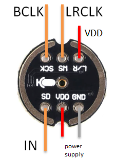
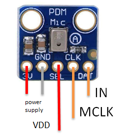
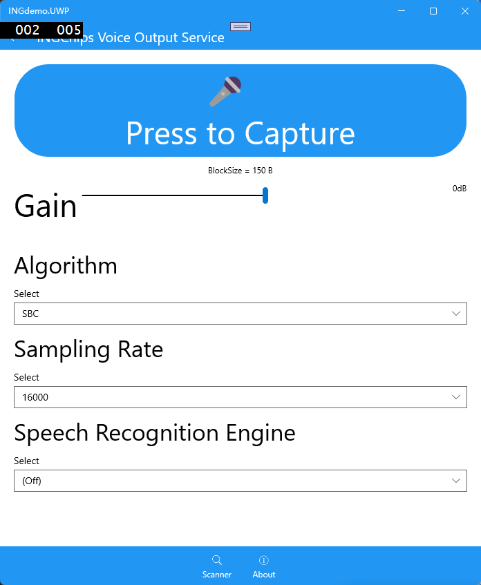

# Voice Remote Control

This example is a remote control with voice.

## Hardware Setup

The key matrix is available on the dedicated remote control board. To simplify the test,
`BOARD=BOARD_DEV` has been used to test audio feature only on Dev-Boards.

This example support several audio input types which is selected by defining `AUDIO_INPUT=0..3`.
Below table shows how to connect the microphone to the Dev-Board for each input type:

|Audio Input        | Note                          | ING918xx Family   | ING916xx Family           | Tested Microphone |
| ---               | ---                           | ---               | ---                       | ---               |
|0                  | Simulated                     | Universal         | Universal                 | --                |
|1                  | ADC                           | ADC Channel 4     | ADC Channel 4             | Analog MIC        |
|2                  | I2S                           | Not available     | BCLK(21),IN(22),LRCLK(35) | INMP441: |
|3                  | PDM                           | Not available     | MCLK(28),IN(29)           | MP34DT01: |

Note: for type `0`, audio is playback from a data file (ITU standard testing data), and no microphone is used.
The [data file](../data/itu_female_16k.bin) containing raw PCM samples needs to be downloaded to
[`SAMPLES_LOCATION`](../src/audio_input_sim.c).

## Audio Codec

Supported codecs:

| Name | Identifier  | Note |
| :-----------: | :-------------------      | :------------------- |
| 4-bit ADPCM   | `AUDIO_CODEC_ALG_ADPCM`   |  |
| SBC           | `AUDIO_CODEC_ALG_SBC`     |  |

Audio codec can be configured by defining `AUDIO_CODEC_ALG` to the corresponding codec identifier.

SBC codec implementation used in this project is [libsbc](https://github.com/google/libsbc).

## Test

Download this example to a Dev-Board, use _ING BLE_ to connect to it. Keep the "Capture" button pressed
to capture voice data. Say something to the microphone if other types than `0` is used. Check the playback of voice data.

Choose an audio decoding algorithm, and press the "Capture" button to start capturing voice data.
Audio that has been processed by different audio codec algorithms may have different effects.
Note: algorithm selection on APP side should be consistent with algorithm selection on MIC side.

## Design Details

* Software based key matrix scan is implemented in [`kb_scan.c`](../src/kb_scan.c);
* Audio is encoded in ADPCM or SBC and transmitted to _ING demo_ through _INGCHIPS Voice Output_ Service;
* Encoder selected macro defined switch in [`audio_encoder.h`](../src/audio_encoder.h).