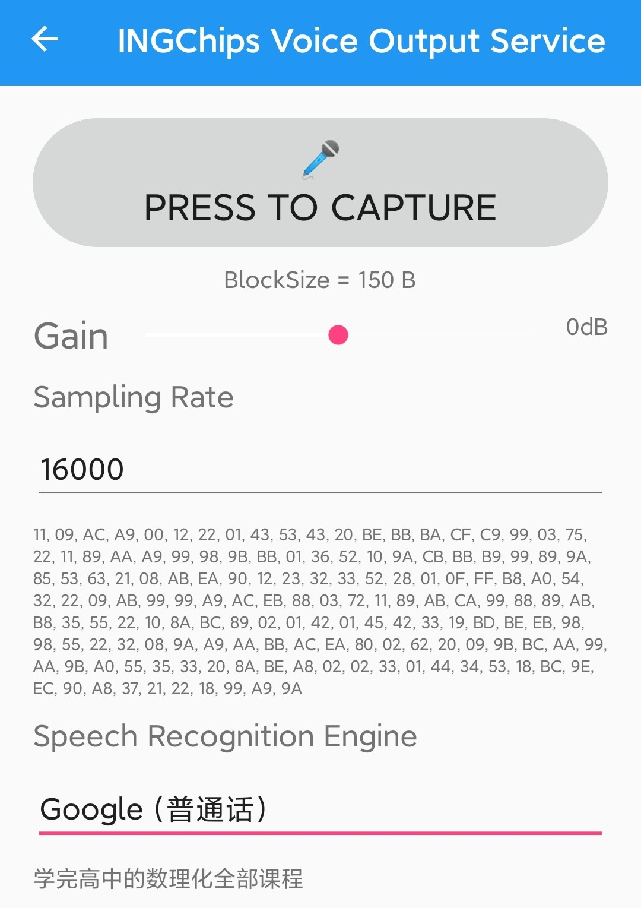

# Voice Remote Control

This example is a remote control with voice.

## Hardware Setup

The key matrix is available on the dedicated remote control board. To simplify the test,
`BOARD=BOARD_DEV` has been used to test audio feature only on Dev-Boards.

This example support several audio input types which is selected by defining `AUDIO_INPUT=0..3`.
Below table shows how to connect the microphone to the Dev-Board for each input types:

|Audio Input        | Note                          |ING918xx Family    | ING916xx Family           | Tested Microphone |
---                 | ---                           | ---               | ---                       | ---               |
|0                  | Simulated                     | Universal         | Universal                 | --                |
|1                  | ADC                           | ADC Channel 4     | ADC Channel 4             | Analog MIC        |
|2                  | I2S                           | Not available     | BCLK(28),IN(29),LRCLK(30) | INMP441           |
|3                  | PDM                           | Not available     | MCLK(28),IN(29)           | MP34DT01          |

Note: for type `0`, audio is playback from a data file (ITU standard testing data), and no microphone
is used.

## Test

Download this example to a Dev-Board, use _ING BLE_ to connect to it. Choose a speech recognition engine.
press the "Capture" button to start capturing voice data. Say something to the microphone if other types
than `0` is used. Check the playback of voice data. After a while, release the button, check if the
captured voice can be recognized by the engine. Note: speech recognition is only available for 16000Hz
sampling rate.

## Design Details

* Software based key matrix scan is implemented in [`kb_scan.c`](../src/kb_scan.c);
* Audio is encoded in ADPCM and transmitted to _ING BLE_ through _INGCHIPS Voice Output_ Service.